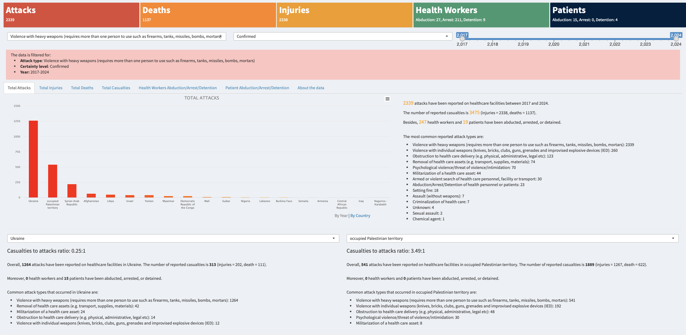

# Attacks on Healthcare Facilities

As part of my studies at [MIT Emerging Talent](https://emergingtalent.mit.edu), I participated in a Collaborative Data Science Project where our team undertook a crucial study focused on analyzing the profound impact of attacks on healthcare facilities. Our project delves into the human casualties resulting from these attacks, highlighting the broader implications for global health security and international humanitarian law.

Read more about our work [here](https://github.com/MIT-Emerging-Talent/2024-group-06-cdsp).

We have also developed two dashboards: one in Python using Streamlit and another in R using Shiny, allowing access to detailed findings.

This repository contains the script for the Shiny dashboard.

[https://fahim-ahmad.shinyapps.io/hospitals/](https://fahim-ahmad.shinyapps.io/hospitals/)

**Data**: Surveillance System for Attacks on Health Care (SSA).

The SSA methodology paper can be downloaded from [WHO's publication platform](https://www.who.int/publications/i/item/surveillance-system-for-attacks-on-health-care-(-ssa)).
